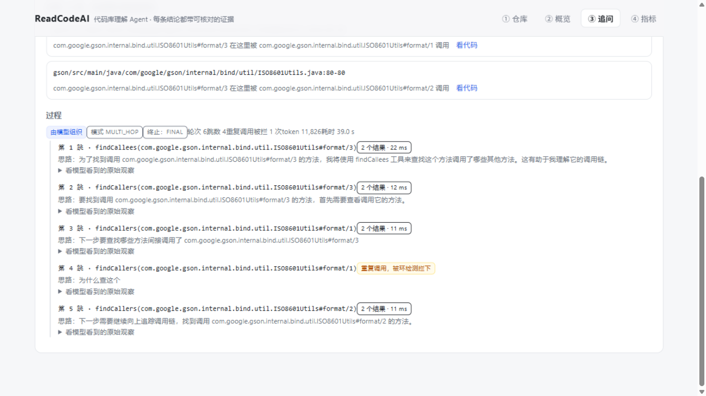

# ReadCodeAI


给一个 GitHub 仓库或本地代码库，它先告诉你**这个库是干什么的**，然后你可以接着追问代码里的问题。
每条结论都带「文件 + 行号 + 原文片段」的证据，**点开就是磁盘上的真实代码** ——
编造的路径、行号或片段过不了核验，会被挡下来，而不是原样递给你。

用一句话概括它和"把代码丢给 AI 让它读"的区别：

> **能算准的，绝不叫模型猜。**
> 「谁调用了这个方法」「这个类有哪些实现」这类问题，答案是查符号表和图算出来的；
> 模型在这套流程里只负责两件事：决定"还要再查什么"，以及把查到的东西讲清楚。

## 它能做什么

| 能力 | 说明 | 需要模型吗 |
|---|---|---|
| **索引仓库** | 三个入口：GitHub 链接 / 服务器本地路径 / 上传 zip。**异步执行**：提交立刻返回任务，进度按阶段可查（已解析 N/M 个文件）；产出符号表、调用图、类型关系、可检索的代码块 | 否 |
| **定位符号** | 「X 定义在哪」，精确到文件与起止行 | 否 |
| **调用关系** | 谁调用了它 / 它调用了谁（未解析的调用如实计入缺口，不假装没有） | 否 |
| **实现关系** | 某个接口有哪些实现类 / 某个类有哪些子类 | 否 |
| **全文检索** | 按标识符或注释里的原词搜代码（中文注释也能搜）；**xml / yml / md / sql / 前端源码等文本文件也可搜**（只做检索，不进符号表与调用图） | 否 |
| **结构化摘要** | 模块划分、规模、入口、调用枢纽、实现关系、没有调用者的类 —— **全部查库算出来**；每个模块"大致负责什么"由模型补一句话，且它提到的符号名会回索引核对 | 可选 |
| **追问（单跳）** | 一次检索 + 模型组织答案，答案必须带证据 | 是 |
| **追问（多跳）** | 模型自己决定"再查什么、跳几跳、什么时候停"，配套环检测与四维预算（轮次/时长/token/成本） | 是 |
| **代码审查** | 规则先算出能算的（超长方法、空 catch、没有人调用、调用盲区占比），模型再补它读出来的问题（每条带证据） | 可选 |
| **自动评估** | 自动出题 + 自动判卷，答案由静态分析算出，不花 token、可复现 | 否 |

## 快速开始

### 1. 环境要求

- **JDK 21**
- **Maven 3.8+**
- **MySQL 8**（用到 ngram 全文解析器，MySQL 8 自带）
- **Node 20+**（只有改前端时才需要）

### 2. 建库

```sql
CREATE DATABASE readcodeai DEFAULT CHARACTER SET utf8mb4;
```

表结构不用手工建：启动时 `schema.sql` 会自动执行，且全部是 `CREATE TABLE IF NOT EXISTS`，重复启动安全。

### 3. 配置（只从环境变量读，不落配置文件）

```bash
# 必需：数据库口令
export READCODEAI_DB_PASSWORD=你的口令
# 可选（不配也能跑，见下一节）
export READCODEAI_DB_HOST=127.0.0.1
export READCODEAI_DB_USERNAME=root
export READCODEAI_LLM_BASE_URL=https://open.bigmodel.cn/api/paas/v4
export READCODEAI_LLM_API_KEY=你的Key
export READCODEAI_LLM_MODEL=glm-4-flash
# 可选：Redis 只用来做"答案缓存"（同一个问题第二次问，52 秒 → 0.1 秒）
# 不起 Redis 也能跑，只是每次都真算
export READCODEAI_REDIS_HOST=127.0.0.1
export READCODEAI_REDIS_PORT=6379
```

任何 OpenAI 兼容端点都可以（`/chat/completions`），不限某一家。

### 4. 启动

```bash
# 后端（前端产物已经构建过的话，一条命令就够）
mvn spring-boot:run
# 或者
mvn package -DskipTests && java -jar target/readcodeai-0.1.0-SNAPSHOT.jar
```

```bash
# 前端（首次、或改过 frontend/ 下的源码）
cd frontend
npm install            # 全局 npm 缓存无写权限时：npm install --cache .npm-cache
npm run build          # 产物直接写进 src/main/resources/static/
```

然后打开 <http://localhost:8080>。

开发前端时用 `npm run dev`（Vite 起在 5173，把 `/api` 代理到 8080）；改完记得 `npm run build` 一次 ——
**构建产物不进仓库**，就是为了避免"改了源码忘了重建"。

### 5. 不配模型会怎样

**剥掉模型，它仍然是个能用的工具**，而不是一个空壳：

| 情况 | 表现 |
|---|---|
| 没配 `READCODEAI_LLM_*` | 索引、定位、调用关系、实现关系、全文检索、结构化摘要的**结构部分**、自动评估 —— 全部照常可用 |
| 这时问语义问题 | 明确报错说"未配置 LLM，语义问答不可用"，并说明还剩哪些能力（HTTP 503），**不会静默返回空答案** |
| 摘要的语义部分 | 返回 `semantics.available=false` 与原因，结构部分完整 |
| 代码审查 | 规则部分照常，模型部分标记为不可用 |
| 没起 Redis | **缓存/锁/限流都降级，功能全在**：问答每次真算；索引照常（锁失效会有 warn，此时别开多 worker）；限流放行（保护失效但不阻断） |
| 没起 RabbitMQ（默认模式） | 走进程内队列：一切照常，**代价是重启丢索引任务**（启动时如实标失败） |
| 配了 `queue.mode=rabbit` 但 broker 连不上 | 启动日志**大声降级**为进程内队列（"任务照常能跑，但重启会丢"）；提交时的连接失败会明确报错，不静默吞 |
| 索引任务消费失败 | 消息进死信队列（`readcodeai.index.jobs.dlq`），任务表里写清失败原因；**不无限重投** |

## 用法

四个页面就是完整流程：**① 添加仓库 → ② 看概览 → ③ 追问 → ④ 看指标**；
另有 **⑤ 运行状态**（只读）：模型 / 缓存 / 队列 / 锁 / 限流逐项报"可用还是降级"，
排查"为什么这次没有语义问答"这类问题不用去翻日志。

### 追问：答案分三块

**结论 / 证据 / 过程**。证据卡片能点开，显示的是**磁盘上此刻的真实内容**，
并告诉你"这个文件在索引之后有没有被改过"（改过则行号可能已漂移）。

两条自动分流（都不用你选）：

- **总结类问题**（"这个项目是干什么的""有哪些模块"）→ 不走检索，直接读**结构化摘要**：
  规模、模块划分、入口与调用枢纽都由索引算出（每条证据都能点开核对），"它做什么"由模型依据这些材料组织。
  实测：同一个「这个项目是干什么的」，走多跳 93 秒仍没有结论；走摘要 0.2 秒（缓存）/ 首次约 15 秒给出答案。
- **确定性问题**（"谁调用了 X"）→ 查调用图，不经模型（毫秒级、0 token）。

**深链模式**（追问页勾选，多跳时可用）：把多跳的轮次从 8 提到 14、时长与 token 额度同步放宽，
用来追长链。它换来的是**查到更多**（一次实测：轮次 7→13、命中证据 4→7），
**不保证给出结论** —— 那取决于模型什么时候收尾。额度在配置里（`readcodeai.llm.deep.*`），
界面只能选要不要 —— 预算是闸门，不该由前端填数字。



### 证据核对：点开就是真实代码


### 指标：运行统计 + 一键跑评估

这一页有**两块账，分开报**：

- **运行统计**（左侧一进来就加载）：来自真实问答的流水 —— 问了多少次、拒答率、
  实际花了多少 token、缓存省下多少、按路线（静态 / 单跳 / 多跳）分布。
  每问一次记一行（`answer_log`），答不上来的也记。
- **自动评估**（按钮触发）：题目自动生成、答案由静态分析算出、判卷也是程序做的 ——
  几秒跑完、不花 token、同一 seed 完全可复现。


> 自动评估那个高命中率**必须打星号**：题从索引出、答案也从索引答，同源，所以它是**按构造**的，
> 衡量的是"确定性管线有没有丢信息、有没有走错路"，**不是**开放问答的准确率。
> 界面上也把这句写在数字旁边 —— 所以它不和"运行统计"混成一个数字。

## 接口一览

统一返回 `{code, message, data}`（`code=0` 成功，HTTP 状态码同时体现）。

| 方法 | 路径 | 说明 |
|---|---|---|
| GET | `/api/repos` | 已索引仓库列表（含解析成功率、调用解析率） |
| POST | `/api/repos` | **提交索引任务**：`{"path"}` 或 `{"gitUrl"}` → 立刻返回 `{id, repoId, status, stage}` |
| GET | `/api/repos/{id}` | 单个仓库：仓库记录 + **最近一次索引任务的进度** |
| POST | `/api/repos/upload` | 上传 zip 建索引（multipart，字段名 `file`），同样异步 |
| DELETE | `/api/repos/{id}` | 删除索引（子表随外键级联） |
| GET | `/api/index-jobs/{id}` | 索引任务的进度：`stage / done / total / percent` |
| GET | `/api/index-jobs/queue` | 队列状态：正在跑几个、排队几个 |
| GET | `/api/symbols/locate?repoId=&name=` | 定位符号 |
| GET | `/api/symbols/{id}` | 符号详情 |
| GET | `/api/symbols/{id}/callers` · `/callees` · `/implementations` | 调用关系与实现关系 |
| GET | `/api/search?repoId=&q=` | 全文检索 |
| POST | `/api/ask` | 单跳问答（`{repoId, question, scopePath?, topK?}`） |
| POST | `/api/agent` | 问答（`{repoId, question, mode: single\|multi, deep?: bool}`）：总结类问题自动走结构化摘要；`deep=true` 用深链额度 |
| GET·POST | `/api/summary` | 结构化摘要（`semantics=false` 只要结构；`refresh=true` 强制重新生成语义） |
| POST | `/api/review` | 代码审查（`{repoId, target, focus?}`，`target` 是类名或符号 id） |
| GET | `/api/files/content?repoId=&path=&startLine=&endLine=` | 读磁盘上的真实文件内容（证据核对用） |
| POST | `/api/eval/run` | 跑评估集（`{repoId, seed?, perType?}`） |
| GET | `/api/metrics?repoId=` | **运行统计**：问答流水的累计（次数、拒答率、token、成本、缓存省下、按路线分布）；不传 `repoId` = 全部仓库 |

## 配置项

都在 `application.yml` 的 `readcodeai.*` 下，可用环境变量或启动参数覆盖。

| 配置 | 默认 | 说明 |
|---|---|---|
| `llm.enabled` | `true` | 关掉即降级为无模型模式 |
| `llm.base-url` / `api-key` / `model` | 空 | 三样都给齐才启用真实客户端 |
| `llm.timeout-seconds` | 60 | 单次调用超时 |
| `llm.max-rounds` | 8 | 多跳轮次上限。**最后一轮留给结论**，所以实际最多查 6 跳 |
| `llm.keep-full-observations` | 2 | 提示词里保留几跳的原始输出；更早的轮次压成一行事实（`0` = 不压缩） |
| `llm.max-duration-ms` | 60000 | 多跳时长预算（决定"不再发起下一轮"，不中断进行中的调用） |
| `llm.max-estimated-tokens` | 60000 | 多跳 token 预算 |
| `llm.max-estimated-cost` | 0.5 | 成本预算（按单价估算；免费档单价为 0 时这一维不起作用） |
| `llm.deep.max-rounds` / `max-duration-ms` / `max-estimated-tokens` | 14 / 180000 / 120000 | **深链模式**（追问页勾选）放宽的那三项额度：14 轮 = 实际最多查 12 跳。成本上限刻意不分深浅。实测它换来"查到更多"（7→13 轮、证据 4→7），不保证给出结论 |
| `index.workspace` | `~/.readcodeai/repos` | 远程拉取与上传解压的存放目录 |
| `index.max-file-size-kb` | 2048 | 单文件超过就跳过并记录 |
| `index.parse-threads` | 0 | 解析并行度：`0` = 自动（核数与 8 取小），`1` = 串行（对照组/逃生门） |
| `index.optimize-fulltext-threshold` | 200 | 索引收尾时重建全文索引的阈值（检索单元数）。**重复索引会留碎片**：实测把检索从 65 ms 拖到 13 秒，重建一次几百毫秒；`0` = 关闭 |
| `queue.mode` | `in-process` | 索引任务投递：`in-process`（零依赖，重启丢任务）/ `rabbit`（持久化、重启续跑、可扩消费者） |
| `queue.concurrency` | 1 | 同时跑几个索引（MQ 模式）。实测三个仓库 1→38s、3→24s；调大前请确认锁可用 |
| `queue.name` / `dlq-name` | `readcodeai.index.jobs(.dlq)` | 主队列与死信队列（消费失败进 DLQ，不无限重投） |
| `lock.enabled` | `true` | 按仓库路径的 Redis 互斥锁（防同一仓库被并发索引）；Redis 挂了会告警但放行 |
| `rate-limit.enabled` / `capacity` / `refill-per-minute` | `true` / 10 / 20 | 会调模型的四个接口的令牌桶限流（跨实例，Lua 原子） |
| `cache.enabled` | `true` | 答案缓存开关；关掉或 Redis 连不上都只是"每次真算" |
| `cache.answer-ttl-minutes` | 1440 | 答案缓存的 TTL（键里含索引版本，重新索引即自动失效） |
| `verify.support-check` | `mark` | ③ 层核验（代码是否支持结论）：`off` 不判 / `mark` 判定并把"不支持"标出来 / `reject` 判成不支持就拒答 |
| `embedding.enabled` / `model` / `dimensions` | `true` / `embedding-3` / `1024` | 向量检索**基线**（对比实验用，未接问答路由）；与 LLM 共用连接配置，关掉不影响问答 |
| `spring.data.redis.*` | 127.0.0.1:6379 | Redis 连接（走环境变量 `READCODEAI_REDIS_*`） |
| `retrieve.top-k` | 8 | 一次给模型的代码块上限 |
| `retrieve.max-context-tokens` | 30000 | 上下文预算 |
| `retrieve.max-chunks-per-file` | 3 | 防止热门文件霸占上下文 |

## 架构

```
api/          REST 接口（前端与脚本都走它）
agent/        多跳循环：AgentLoop + 工具集 + 环检测 + 四维预算 + 模型输出契约
agent/cache/  答案缓存（Redis；连不上自动降级为不缓存）
retrieve/     检索：符号查询（确定性）· 全文检索（ngram）· 向量相似度（基线，只做对比实验不接路由）
evidence/     证据核验（① 文件行号有效 ② 片段与磁盘一致 ③ 代码是否**支持**结论：模型判定，默认只标记不丢弃）
index/        索引：扫描 → JavaParser 解析 → 符号/调用图/类型关系落库；含异步任务与进度
index/queue/  任务投递：进程内队列（默认）/ RabbitMQ（持久化 + 死信 + 多消费者）+ Redis 仓库锁
summary/      结构化摘要（结构查库 + 模型补一句话 + 回索引核对）
review/       代码审查（规则算的 + 模型读的，两份分开返回）
eval/         自动出题与自动判卷
frontend/     Vue 3 + Vite（构建产物写进 src/main/resources/static/）
```

数据库 9 张表：`repo` `source_file` `symbol` `call_edge` `type_relation` `chunk` `question` `eval_run` `repo_summary`。
（设计文档里的第 10 张 `answer_log` —— 用于记录每次问答的 token 与耗时 —— **还没建**，见「已知限制」。）
调用图**保留解析不出来的调用**（`resolved=0` + 原文 + 原因），把"没解析出来"和"不存在"严格区分开。

## 设计上的几个取舍

- **按符号切分，不按行切**：按固定行数切会把方法拦腰截断，检索出来的证据天然不完整。
- **问题先路由，再决定用不用模型**：确定性问题（定位、调用、实现、结构）不叫模型 ——
  把确定性换成不确定性是净亏。
- **证据分三层核验**：① 文件与行号是否有效 → ② 片段是否与磁盘一致（真读文件）→ ③ 这段代码是否支持结论。
  **①② 是程序做的**（零成本、结论确定）；**③ 要额外叫一次模型**，所以默认行为是**把"不支持"标出来、
  不直接丢答案**（`verify.support-check=mark`，可改 `reject` 或 `off`）。实测：程序构造的张冠李戴与
  过度断言 8/8 全被判出、正确样本 0 误报，代价约 +2 秒 / +500 token —— 数字与边界见 `docs/verification-log.md`。
- **不引 AI 框架**：需要的只是一个 HTTP 接口和一段手写的工具调用循环，自己写才讲得清、测得动。
- **不引向量库**：代码检索的主要形态是"精确标识符"和"图查询"，语义相似度只对少数模糊问题有用。
  向量基线已实现（存 MySQL BLOB、进程内算余弦、按需补算缓存），但**不接问答路由**——
  对比实验实测它在这套评估题上召回上限 20%（见"实测与已知限制"），这个判断现在是实测结论不是偏好；
  真到了几十万 chunk 或多实例共享，再考虑 pgvector。
- **缓存要可见**：摘要的语义部分按「仓库 + 索引版本 + 模型名」缓存，接口把
  `cached / generatedAt / token 用量` 一起返回，页面标出"来自缓存"并提供「重新生成」——
  悄悄给你一份上次的说明是不行的。

更完整的设计说明（洞察、数据模型、阶段计划）见 [docs/design-outline.md](docs/design-outline.md)。

## 测试

```bash
# 需要本机 MySQL；语料目录用 -Dreadcodeai.verify.repo 指定（默认 sample-repos/）
mvn test -Dreadcodeai.verify.repo=/path/to/a/java/repo

# 需要真实模型的用例（连通性、单跳问答、多跳实验）在没配 Key 或接口不可达时自动跳过并写明理由
export READCODEAI_LLM_API_KEY=...
mvn test -Dreadcodeai.verify.repo=/path/to/a/java/repo
```

当前：**187 个测试 · 0 失败 · 6 跳过**（跳过的是网络用例、与语料相关的可选断言、模型接口不可达、broker/Redis 不在、以及默认不跑的大仓库基准）。

### 持续集成

每次 push 到 `main`（或提 PR）会由 GitHub Actions 自动跑一遍**离线测试集**（约 2 分钟）：

```bash
mvn -B test -Dreadcodeai.verify.repo=.     # 语料用这个项目自己：零下载、零合规风险
```

配置在 [`.github/workflows/test.yml`](.github/workflows/test.yml)：GitHub 免费提供 Linux 机器，
MySQL 8 与 Redis 用临时容器起在旁边，跑完即销毁。

**CI 里刻意不放 API Key**，因此**会调模型的用例会自动跳过**（它们本来就有"没配模型就跳过"的门禁），
于是 CI 天然只跑离线集：

| 在哪跑 | 跑什么 | 为什么 |
|---|---|---|
| **CI（每次 push）** | 离线集（约 2 分钟） | 快、确定、不花钱；把"跑不过就别提交"交给机器 |
| 本地（开发时） | 定向用例（`-Dtest=...`，几秒到几十秒） | 改哪儿测哪儿 |
| 本地（里程碑） | 全量（含真实模型，约 12 分钟） | 要更新验证记录里的实测数字时才跑 |

## 实测与已知限制

关键数字与实验记录都在 [docs/verification-log.md](docs/verification-log.md)，包括：

- 调用图准确率的人工抽查（用 IDEA 的 Find Usages 当基准，含差异归因）
- 证据核验拦下了什么（逐条构造编造，看能不能过）
- 自动评估集在 gson 上 211 题的结果，以及**为什么这个数字要打星号**
- 单跳 vs 多跳的对比实验（真值由调用图反向 BFS 算出）：单跳上限 24.4% → 多跳 86.7% 平均召回；
  以及**结论率只有 3/15** 这个短板的真实数据
- 摘要缓存的效果（首次 14.4 秒 → 之后 0.097 秒）
- 异步索引：提交返回 16 秒 → **196 ms**，索引期间其它接口仍 **12 ms** 可用，进度按阶段可查
- 答案缓存（Redis）：同一个问题第二次 **52.9 秒 → 0.113 秒**（约 468 倍），且一个 token 不花；
  杀掉 Redis 后问答照常（只是每次真算）
- 代码审查的实测：规则稳定可用、模型意见多数不可用，以及"证据全对、结论全错"的具体例子
- **排除规则的隐藏坑**（CI 第一次跑抓到的）：Java 的 glob 里 `**/target/**` **匹配不到根目录下的
  `target/`**，于是根下的构建产物一直进了索引（实测 192 段），检索会命中"构建出来的副本"、
  证据核验还会因为文件被重写而失败。已给每个 `**/x/**` 补一个"去前缀"版本（根目录与子目录都生效），
  默认排除项也补上了 `node_modules/dist/.git`
- **全文检索碎片**：一天里反复重索引之后，同一个检索从 **65 ms 退化到 13,355 ms**（200 倍）——
  根因是 InnoDB 的 ngram 索引碎片累积（3007 个 chunk 对应 6170 万条索引项）。
  索引收尾按阈值自动重建（gson 规模 2.6 秒），实测 `AgentAnswerCacheTest` 从 299 秒回到 6 秒
- **索引性能（先测后改）**：gson 索引 17.4s → **5.1s** —— 瓶颈其实在落库（占 70%），根因是
  「逐行插入 + 每行一次自动提交」；批量化 + `rewriteBatchedStatements` 把落库从 12.1s 压到 0.8s。
  再按文件**并行解析**（结果按原序归并，串行/并行的结构指纹逐条一致）：十万行档解析提速 **4.84x**、
  端到端 26.2s → **15.0s**
- **大仓库基准**（补上"十万行拐点"这条欠账）：23.8 万行 15.0s / ≈1.8 GB；
  **132 万行（JDK java.base）100.1s / ≈6 GB** —— 时间是线性的，**内存才是真拐点**
  （AST、文件行文本、切片内容全量驻留），再往上要按模块分批或流式处理
- **中间件三件套（MQ / Redis 锁 / 限流）**：索引任务队列化后，**索引中途杀进程再重启，任务自动续跑至
  READY**（对照：进程内队列同一场景是 FAILED、要人工重交，重启到完成 30 秒）；多 worker 实测
  三个仓库（23.8 万 + 17.9 万 + 3.8 万行）并发 1 是 38 秒、并发 3 是 24 秒；Redis 令牌桶限流实测
  `10×200 → 429`（带 Retry-After），Redis 停掉后放行（fail-open）
- **多跳提示词瘦身**：旧轮次的代码文本压成"一行事实"（保留查到的名字与证据位置）。
  同一条脚本轨迹下 6 轮合计 **45,958 → 35,220 字符（省 23%），末轮省 36%**；
  真实模型 A/B 因为两条轨迹会分叉，只能说"没有观察到变差"（召回都 100%）—— 这个区分记在验证记录里
- ③ 层核验（这段代码是否**支持**结论）：程序构造的张冠李戴 + 过度断言 **8/8 全被判出**、
  正确样本 **0 条误报**（4 条里 3 条判支持、1 条判"判不了"），代价约 **+2 秒 / +500 token**；
  同一批样本第一版的数字更差 —— 因为**样本本身是错的**，那段过程也记在验证记录里
- **第一组对比实验（纯向量 vs 三层检索）**：同一批 131 道评估题，纯向量 RAG 的召回@8 上限 **20.0%**，
  确定性路由 100%（量尺自检）；分题型 LOCATE 40% / CALLERS 29% / CALLEES 5% / IMPLEMENTS 0% ——
  向量相似度找的是"文本长像"，不是"图上的关系"，这就是检索不交给向量的实测理由。
  向量存 MySQL 不引向量库，首次补算 1515 chunk 花 13.2 万 token（几分钱），之后重跑零成本

**已知限制**（每条在验证记录里都有数据）：

1. **③ 层核验是模型判的，不是程序判的**：它能抓出"证据真实、但与结论不是同一件事"
   （构造样本 8/8 检出），但**判错是可能的** —— 所以默认只标记、不拒答。
   判定失败会如实记为"这次没核验成"（`UNAVAILABLE`），**不会被当成通过**；
   样本量也还小：真实问答那一组只测到个位数条。
2. **只解析 Java**（文本文件可检索，但**没有**符号与调用关系）：xml / yml / md / sql / 前端源码
   会被切成文本块进检索（能搜到），但不进符号表与调用图 —— 所以 Java + Kotlin 混合的仓库里，
   **Kotlin 调用 Java 方法看不见**，"谁调用了它"会漏掉那部分调用者。多语言深度解析是明确的范围决策（见设计文档非目标）。
3. **静态分析的盲区**：反射、动态代理、Lombok 生成代码、泛型擦除 —— 未解析的调用如实计入缺口，不补猜。
4. **多跳的结论率偏低**：模型常常查得很起劲但不肯收尾；此时退回"没有结论，但把查到的链路与证据一并交出"。
5. **代码审查只看单个类**：跨文件的一致性问题（同一个状态码在两个文件里含义不同）看不到。
6. **摘要不进自动评估**：它没有唯一正确答案，所以只能标"名字在不在索引里"，不能判对错。
7. **向量检索只是基线，且"中文鸿沟"仍未量化**：向量层已实现（存 MySQL、不引向量库、按需补算缓存），
   但**没有接进问答路由**——对比实验实测它在五类可算准的题上召回上限只有 20%（路由 100%），
   这就是不接的理由。而立项动机"中文提问 ↔ 英文标识符"的鸿沟也还没量化：让小模型把题面改写成
   纯中文的路线失败了（12 条改写全部仍含标识符），后续要换路子。
8. **重新索引会重建仓库记录**：同一个路径重新索引是"删了再插"，所以 `repoId` 会变 ——
   脚本里别把它当长期稳定标识，每次先 `GET /api/repos` 查一遍。
9. **索引任务默认不持久化**（可用 MQ 解决，默认不开）：默认的进程内队列重启就丢任务，
   启动时如实标成失败并提示"请重新提交"。把 `readcodeai.queue.mode` 改成 `rabbit` 之后，
   未确认的消息会被重新投递：**实测索引中途杀进程再重启，任务自动续跑至 READY**（30 秒）。
   两种模式的取舍写在验证记录里，默认保持 in-process 是为了"没装 broker 的机器开箱即用"。
10. **多 worker 需要一个共享工作区**：`queue.concurrency > 1` 时多个索引会同时跑，
   上传的压缩包落在 `index.workspace` 下 —— 单机没问题，**多实例部署时这个目录必须共享**；
   同一仓库的互斥由 Redis 锁保证（Redis 不可用会告警并放行，那种情况下别开多 worker）。
11. **问答的用量没有落库**：设计文档里的 `answer_log` 表（记录每次问答的 token、耗时、是否拒答）还没建，
   所以现在看不到"累计花了多少、拒答率多少"这类指标 —— 指标页展示的是自动评估的结果，不是运行统计。

## 目录

```
src/main/java/com/readcodeai/   后端（Java 21 / Spring Boot 4）
src/main/resources/schema.sql   建表脚本（启动时自动执行）
frontend/                       前端源码（Vue 3 + Vite，产物不进仓库）
docs/design-outline.md          设计文档
docs/verification-log.md        验证记录（每个阶段的实测数字与边界）
```
