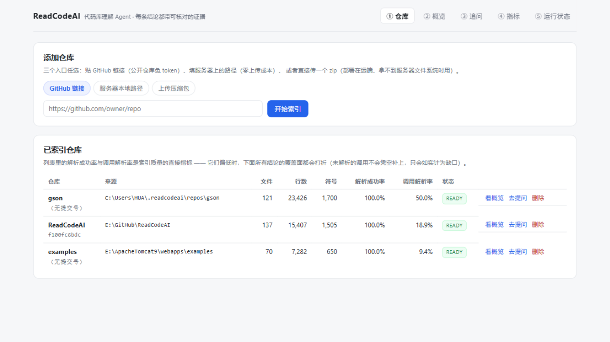
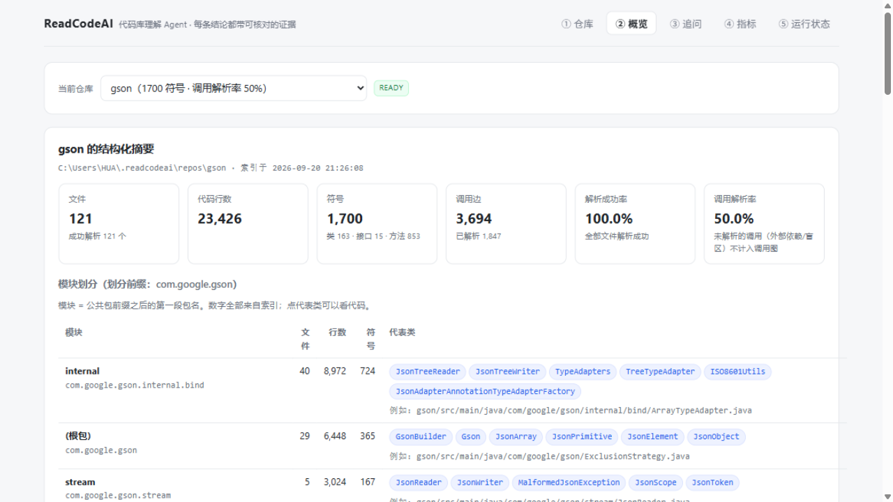
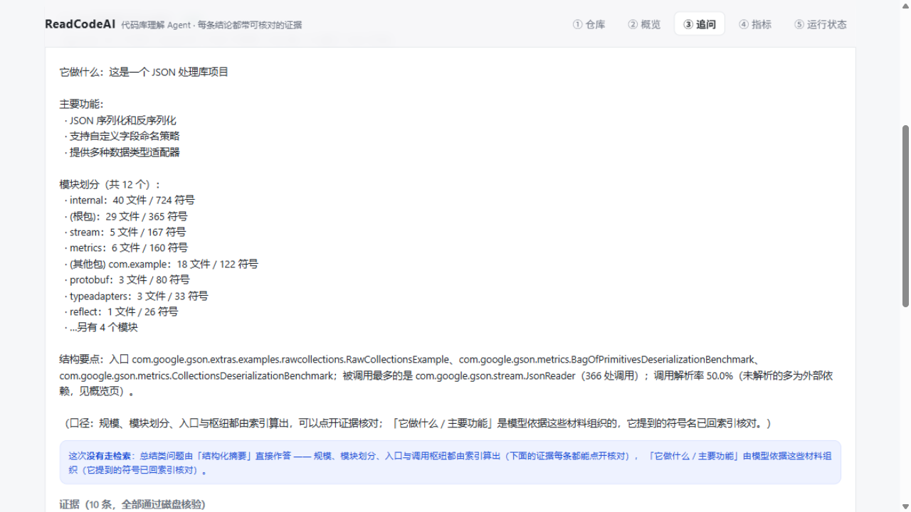
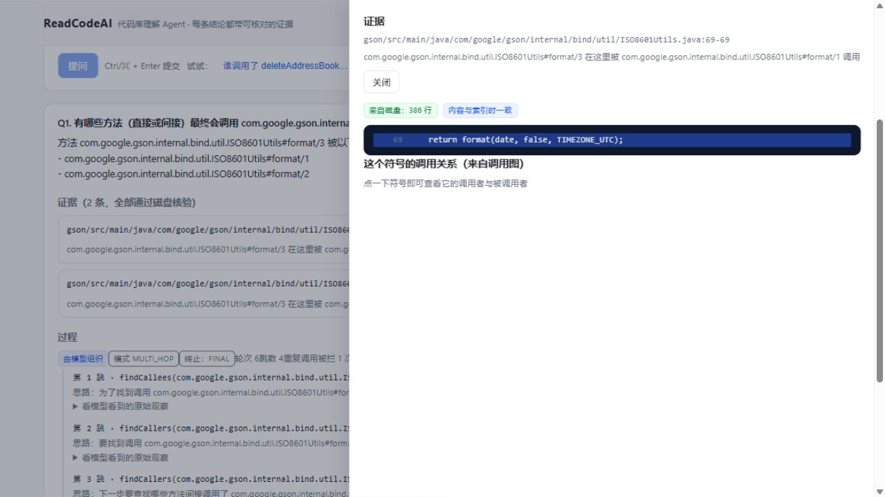
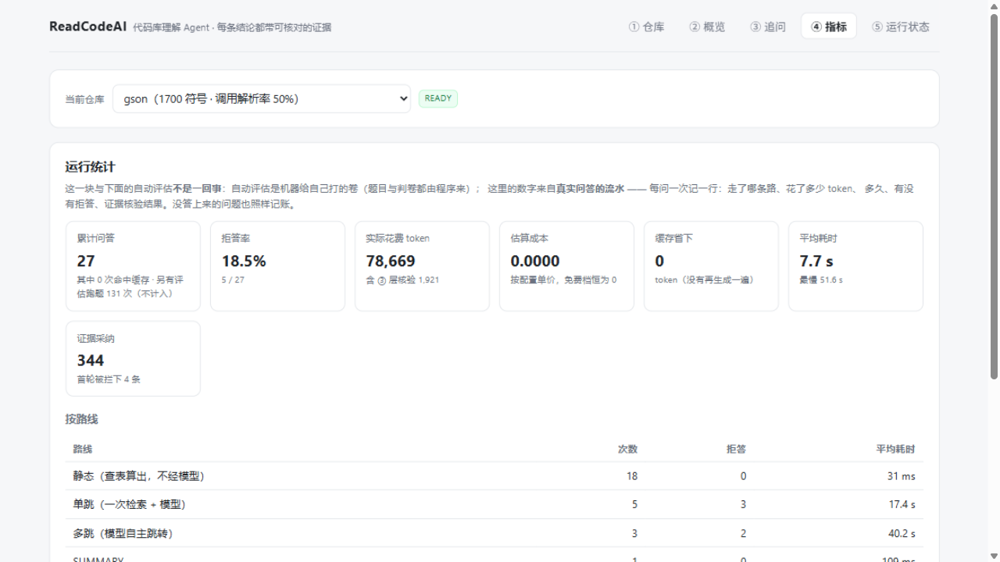
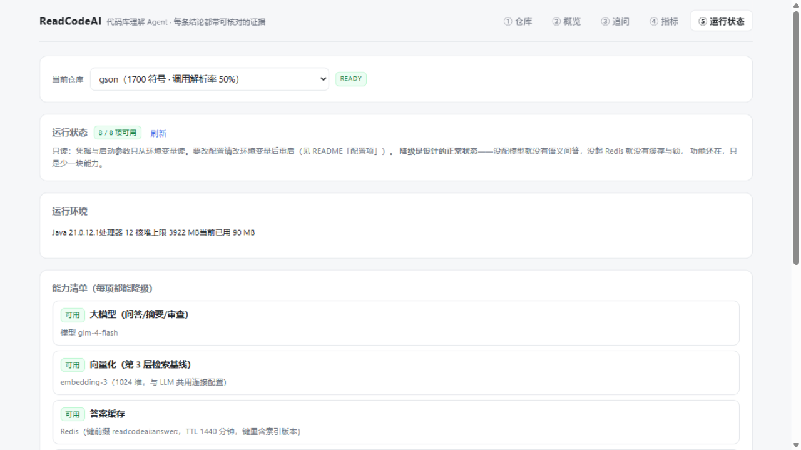
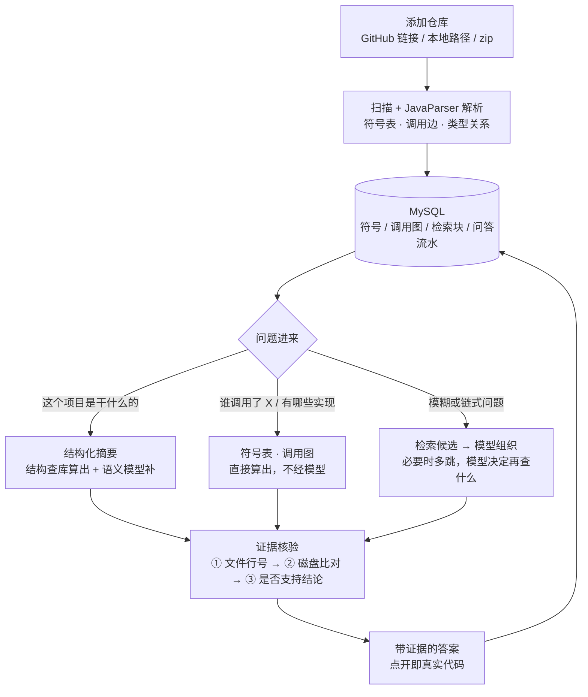

<div align="center">
  <h2>ReadCodeAI</h2>

  <p>
    <a href="https://github.com/78HUA/ReadCodeAI/actions/workflows/test.yml"></a>
    
    
    
    
    
    
    
  </p>
</div>

<div align="center">

给一个代码库，先告诉你 <strong>它是做什么的</strong>，再回答「谁调用了它」「这个参数从哪来」。

每条结论都带「文件 + 行号」，<strong>点开就是磁盘上的真实代码</strong> —— 编造的路径、行号或片段过不了核验，会被挡下来，而不是原样递给你。

</div>

---

## 项目预览

**① 添加仓库，看到索引质量**



三个入口：GitHub 链接（公开仓库免 token）、服务器本地路径（零上传成本）、上传 zip（部署在远端时用）。
列表里的**解析成功率**与**调用解析率**是索引质量的直接指标 —— 它们偏低时，后面所有结论的覆盖面都会打折，所以直接摆在第一屏。

**② 概览：这个库是干什么的**



规模、模块划分、入口、调用枢纽**全部查库算出来**；每个模块「大致负责什么」由模型补一句话，且它提到的符号名会回索引核对。
摘要里的每个名词都能点开看代码 —— 这是"算出来的总结"和"让模型读一遍再复述"的区别。

**③ 追问：分层作答，答案带证据**



问「这个项目是干什么的」会被自动识别为总结类问题，直接由上面的结构化摘要作答；
问「谁调用了 X」走符号表与调用图（**毫秒级、不花 token**）；只有模糊或链式问题才交给模型，
必要时由模型自己决定继续查什么、跳几跳、什么时候停。

点开任意一条证据，看到的是**磁盘上此刻的真实内容**，并提示这个文件在索引之后有没有被改过：



**④ 指标：真实使用的账 + 一键跑评估**



左边是**运行统计**（每次问答的路线、token、耗时、拒答、证据核验结果，全部落库），
右边是**自动评估**（自动出题、自动判卷、答案由静态分析算出）。两块账分开报，
因为"真实使用了多少"和"机器给自己打分"是两回事。

**⑤ 运行状态：一眼看出哪里降级了**



模型 / 缓存 / 队列 / 锁 / 限流逐项报"可用还是降级"。这个服务的依赖很多是可降级的，
而降级是静默生效的 —— 状态页让"为什么这次没有语义问答"不用去翻日志。
页面**刻意只读**：凭据属于部署者，改配置要动环境变量并重启。

## 核心能力

### 🔎 结构化摘要：先看清全貌

> 「这个库是干什么的」不该靠模型读一遍猜出来 —— 能算的先算，算不出来的才让模型补，并且标清楚哪部分是补的。

- **结构全部来自索引** —— 模块划分、规模统计、入口类、调用枢纽、没有任何调用者的类，每个数字都能点开核对。
- **语义部分单独标注** —— 模型写的每句话里提到的符号名会回索引核对，核对不上的会如实标出来；自说自话的数字同样标出来。
- **没配模型也能用** —— 只是少了一句总结，结构部分照常返回，并写明"语义说明未生成：未配置模型"。

### 🧭 能算准的别猜

> 「谁调用了这个方法」「这个类有哪些实现」有确定答案，让模型去"组织"它，等于把确定性换成不确定性。

- **问题先路由** —— 定位 / 调用关系 / 实现关系 / 结构这几类走符号表与调用图，**4–33 毫秒、0 token**，不经模型。
- **裸名字也能解析** —— 「UploadService 在哪」直接查；多个同名符号时优先解析到类型，并对同名歧义如实提示。
- **全文检索兜底** —— MySQL FULLTEXT + ngram 解析器，中文注释也能搜；xml / yml / md / sql / 前端源码等文本文件同样可搜（只做检索，不进符号表）。

### 🔗 多跳追问（Agent 部分）

> 有些问题的答案要沿调用图跳几跳才拿得到 —— 这类问题单跳不是答得差，是根本答不了。

- **模型自主决定跳向** —— 自己选下一个要查的符号、跳几跳、什么时候收尾。
- **四维预算 + 环检测** —— 轮次 / 时长 / token / 成本任一超限即停；重复调用被拦下并计数；**查不动时退回"没有结论，但把查到的链路与证据一并交出"**，不编。
- **深链模式** —— 追问页可勾选把轮次从 8 提到 14，用来追长链（换来的是"查得更深"，不保证给出结论）。
- **过程可见** —— 每一跳查了什么、返回什么、模型的思路，界面上都能展开看。

### 🛡 证据约束与三层核验

> 让模型知道"你引的代码会被核对"，本身是最便宜的防幻觉手段。

- **① 文件与行号有效** · **② 片段与磁盘逐行一致** —— 这两层是程序读文件比对，零成本。实测：构造的编造路径 / 越界行号 / 篡改片段**全部被拦下**。
- **③ 这段代码是否支持这条结论** —— 前两层证明不了这件事（文件行号都对，但说的是另一件事），所以要模型判；默认只标记不丢弃，判定失败如实记为"没核验成"，绝不当成通过。
- **静态路线的证据同样核验** —— 索引里的行号会随源码改动漂移，所以"查表算出来"的证据一样过 ① 层。

### 🗂 索引与任务：异步、可观测、可降级

> 索引大仓库是长耗时任务，提交接口不该被它拖住，进程重启也不该让任务凭空消失。

- **异步执行** —— 提交立刻返回任务 id，进度按阶段可查（扫描 / 解析 / 落库）；索引期间其它接口照常响应。
- **任务队列可选** —— 默认进程内队列（零依赖，重启丢任务并如实标记）；换成 RabbitMQ 后持久化 + 死信 + 幂等，**实测索引中途杀进程、重启自动续跑至完成**。
- **仓库锁与限流** —— Redis 互斥锁防同一仓库并发索引（Lua 释放 + 租约续期）；会调模型的接口有令牌桶限流（跨实例、Redis 挂了 fail-open）。
- **大仓库有边界，如实告诉你** —— 132 万行（JDK `java.base`）100 秒 / 峰值约 6 GB；内存是拐点，不是时间。超限会 OOM 而不是假装成功。

## 系统流程



## 技术栈

| 层次 | 技术 | 用途 |
| :--- | :--- | :--- |
| 后端 | Java 21、Spring Boot 4.1.1、JdbcTemplate | REST 接口、索引流水线、问答编排 |
| 代码解析 | JavaParser 3.28 | 符号表、调用图、类型层次（纯 Java，无 native 依赖） |
| 存储 | MySQL 8（FULLTEXT + ngram） | 结构化数据 + 全文检索；不引 ORM、不引向量库 |
| 异步与缓存 | RabbitMQ 4（可选）、Redis | 索引任务队列 + 死信；答案缓存、仓库锁、令牌桶限流 |
| 模型 | 任意 OpenAI 兼容端点（默认智谱 GLM） | 语义问答、多跳决策、③ 层核验、摘要语义 |
| 前端 | Vue 3 + Vite | 五个页面；构建产物写进 `src/main/resources/static/` |
| 质量 | JUnit 5、GitHub Actions | 203 个测试；每次 push 跑离线集（约 2 分钟，不花 token） |

## 本地运行

### 环境要求

| 组件 | 要求 | 说明 |
| :--- | :--- | :--- |
| JDK | 21 | 后端运行环境 |
| Maven | 3.8+ | 构建 |
| MySQL | 8 | **必需**（用到 ngram 全文解析器，8.0 自带） |
| Node.js | 20+ | 仅改前端时需要 |
| Redis | 任意版本 | 可选：答案缓存 / 仓库锁 / 限流；不起也能跑 |
| RabbitMQ | 4.x | 可选：索引任务持久化；不起就用进程内队列 |
| LLM API Key | 任意 OpenAI 兼容端点 | 可选：不配也能跑（见下） |

### 1. 建库

```sql
CREATE DATABASE readcodeai DEFAULT CHARACTER SET utf8mb4;
```

表不用手工建：启动时 `schema.sql` 自动执行（全部 `CREATE TABLE IF NOT EXISTS`，重复启动安全）。

### 2. 配置（只从环境变量读，密钥不落仓库）

```bash
# 必需
export READCODEAI_DB_PASSWORD=你的口令

# 可选：不配也能跑 —— 这几样配了才有"语义问答"
export READCODEAI_LLM_BASE_URL=https://open.bigmodel.cn/api/paas/v4
export READCODEAI_LLM_API_KEY=你的Key
export READCODEAI_LLM_MODEL=glm-4-flash

# 可选：Redis（缓存 / 锁 / 限流）与 RabbitMQ（任务持久化）
export READCODEAI_REDIS_HOST=127.0.0.1
export READCODEAI_RABBIT_HOST=127.0.0.1
```

配置只认环境变量，**仓库里没有任何密钥**：命令行 `export`、写进自己的 `.sh`、Docker 的 `-e` 都行。
想换模型或换 Key：改这几个环境变量，**重启服务**即可（界面刻意不提供改配置入口）。

### 3. 启动后端

```bash
mvn spring-boot:run
# 或者打包后运行
mvn package -DskipTests && java -jar target/readcodeai-0.1.0-SNAPSHOT.jar
```

打开 <http://localhost:8080>。前端产物已经构建过的话，这一条命令就够了。

### 4. 前端（首次，或改过 `frontend/` 源码）

```bash
cd frontend
npm install     # 全局 npm 缓存无写权限时：npm install --cache .npm-cache
npm run build   # 产物直接写进 src/main/resources/static/
```

开发前端时用 `npm run dev`（Vite 起在 5173，把 `/api` 代理到 8080），改完记得 `npm run build` 一次。

### 不配模型会怎样

**剥掉模型，它仍然是个能用的工具**，而不是空壳：

| 情况 | 表现 |
|---|---|
| 没配 `READCODEAI_LLM_*` | 索引、定位、调用关系、实现关系、全文检索、结构化摘要的**结构部分**、运行统计、自动评估 —— 全部照常可用 |
| 这时问语义问题 | 明确报"未配置 LLM，语义问答不可用"并列出还剩哪些能力（HTTP 503），**不静默返回空答案** |
| 摘要的语义部分 | 返回 `available=false` 与原因，结构部分完整 |
| 「⑤ 运行状态」页 | 逐项显示哪些能力降级了、为什么 |

### 常见问题

| 现象 | 处理 |
| :--- | :--- |
| 启动报连不上数据库 | 确认 MySQL 在跑、库 `readcodeai` 已建、`READCODEAI_DB_PASSWORD` 与本地一致 |
| 问答报"未配置 LLM" | 正常降级。配 `READCODEAI_LLM_*` 三样后重启；只要不配，确定性问题照常可用 |
| 换模型后还返回旧答案 | 不会：缓存键里含模型名与索引版本。若确实要强制刷新，清掉那个仓库的 Redis key 前缀 `readcodeai:answer:` |
| 改了前端源码但页面没变 | 前端产物不进仓库：在 `frontend/` 里 `npm run build` 一次 |
| 索引很慢 / 内存吃满 | 大仓库先看 `index.max-file-size-kb` 与排除规则；百万行约 100 秒 / 6 GB，内存是拐点 |
| 重新索引后仓库 id 变了 | 同一路径重新索引是"删了再插"，脚本里别把 `repoId` 当长期标识，每次先 `GET /api/repos` |
| 索引任务重启后显示失败 | 默认进程内队列重启会丢任务（如实标记）；把 `readcodeai.queue.mode` 改成 `rabbit` 即可续跑 |

## 接口一览

统一返回 `{code, message, data}`（`code=0` 成功，HTTP 状态码同时体现）。

| 方法 | 路径 | 说明 |
|---|---|---|
| GET | `/api/repos` | 已索引仓库列表（含解析成功率、调用解析率） |
| POST | `/api/repos` | 提交索引任务：`{"path"}` 或 `{"gitUrl"}` → 立刻返回 `{id, repoId, status, stage}` |
| POST | `/api/repos/upload` | 上传 zip 建索引（multipart，字段名 `file`），同样异步 |
| GET | `/api/repos/{id}` | 单个仓库：仓库记录 + 最近一次索引任务的进度 |
| DELETE | `/api/repos/{id}` | 删除索引（子表随外键级联） |
| GET | `/api/index-jobs/{id}` · `/queue` | 索引任务进度与队列状态 |
| GET | `/api/symbols/locate?repoId=&name=` | 定位符号（在哪定义） |
| GET | `/api/symbols/{id}` · `/callers` · `/callees` · `/implementations` | 符号详情、调用关系、实现关系 |
| GET | `/api/search?repoId=&q=` | 全文检索 |
| POST | `/api/ask` | 单跳问答（`{repoId, question, scopePath?, topK?}`） |
| POST | `/api/agent` | 问答主入口（`{repoId, question, mode: single\|multi, deep?: bool}`）：总结类问题自动走摘要 |
| GET·POST | `/api/summary` | 结构化摘要（`semantics=false` 只要结构；`refresh=true` 强制重新生成语义） |
| POST | `/api/review` | 代码审查（`{repoId, target, focus?}`） |
| GET | `/api/files/content?repoId=&path=&startLine=&endLine=` | 读磁盘上的真实文件内容（证据核对用） |
| POST | `/api/eval/run` | 跑评估集（`{repoId, seed?, perType?}`） |
| GET | `/api/metrics?repoId=` | 运行统计：问答流水的累计（次数、拒答率、token、成本、缓存省下、按路线分布） |
| GET | `/api/status` | 运行状态：各组件可用还是降级（只读） |

## 配置项

都在 `application.yml` 的 `readcodeai.*` 下，可用环境变量或启动参数覆盖。

| 配置 | 默认 | 说明 |
|---|---|---|
| `llm.enabled` | `true` | 关掉即降级为无模型模式 |
| `llm.base-url` / `api-key` / `model` | 空 | 三样都给齐才启用真实客户端；只认环境变量 |
| `llm.timeout-seconds` | 60 | 单次调用超时 |
| `llm.max-rounds` | 8 | 多跳轮次上限。**最后一轮留给结论**，所以实际最多查 6 跳 |
| `llm.max-duration-ms` / `max-estimated-tokens` / `max-estimated-cost` | 60000 / 60000 / 0.5 | 多跳的时长 / token / 成本预算，任一超限即停 |
| `llm.deep.*` | 14 / 180000 / 120000 | 深链模式（追问页勾选）放宽的三项额度；成本上限不分深浅 |
| `llm.keep-full-observations` | 2 | 提示词里保留几跳的原始输出；更早的轮次压成一行事实（`0` = 不压缩） |
| `index.workspace` | `~/.readcodeai/repos` | 远程拉取与上传解压的存放目录 |
| `index.max-file-size-kb` | 2048 | 单文件超过就跳过并记录 |
| `index.parse-threads` | 0 | 解析并行度：`0` = 自动，`1` = 串行（对照组/逃生门） |
| `index.optimize-fulltext-threshold` | 200 | 索引收尾时重建全文索引的阈值。**重复索引会留碎片**：实测把检索从 65 ms 拖到 13 秒；`0` = 关闭 |
| `queue.mode` | `in-process` | `in-process`（零依赖，重启丢任务）/ `rabbit`（持久化、重启续跑、可扩消费者） |
| `queue.concurrency` | 1 | 同时跑几个索引（MQ 模式） |
| `lock.enabled` | `true` | 按仓库路径的 Redis 互斥锁；Redis 挂了会告警但放行 |
| `rate-limit.enabled` / `capacity` / `refill-per-minute` | `true` / 10 / 20 | 会调模型的四个接口的令牌桶限流（跨实例，Lua 原子） |
| `cache.enabled` / `cache.answer-ttl-minutes` | `true` / 1440 | 答案缓存（键里含索引版本与模型名，换模型不串答案） |
| `verify.support-check` | `mark` | ③ 层核验：`off` 不判 / `mark` 判定并标出"不支持" / `reject` 判成不支持就拒答 |
| `embedding.enabled` / `model` / `dimensions` | `true` / `embedding-3` / `1024` | 向量检索基线（只服务对比实验，未接问答路由） |
| `retrieve.top-k` / `max-context-tokens` / `max-chunks-per-file` | 8 / 30000 / 3 | 一次给模型的代码块上限、上下文预算、单文件上限 |

## 设计上的几个取舍

- **按符号切分，不按行切** —— 按固定行数切会把方法拦腰截断，检索出来的证据天然不完整。
- **问题先路由，再决定用不用模型** —— 确定性问题不叫模型：把确定性换成不确定性是净亏。
- **不解析出来的调用保留着** —— 反射、动态代理、Lombok 生成的代码解析不了，那就如实记成"未解析 + 原因"，而不是当成"不存在"。
- **证据来自磁盘，不来自索引** —— 索引里的行号会漂移，核验时每次重新读文件、不做缓存。
- **不引向量库、不引 ORM** —— 语料是万级 chunk、查询主要走符号表与调用图；向量相似度找的是"文本长像"而不是"图上的关系"，实测在五类可算准的题上召回上限只有 26%，所以它只用于对比实验。
- **降级是一等公民** —— 没 Key / 没 Redis / 没 broker 都能跑，缺什么在日志与状态页如实说，绝不静默假装正常。

## 工程结构

```
src/main/java/com/readcodeai/
├── api/          REST 接口
├── agent/        问答编排：静态 / 单跳 / 多跳 / 摘要路由 + 答案缓存 + 问答流水
├── retrieve/     检索：符号查询（确定性）· 全文检索（ngram）· 向量（基线）
├── evidence/     证据核验（①② 程序化 · ③ 模型判定）与定向修正
├── index/        索引：扫描 → JavaParser → 落库；含任务队列、仓库锁、并行解析
├── summary/      结构化摘要（结构查库 + 语义模型补 + 回索引核对）
├── review/       代码审查（规则算的 + 模型读的，两份分开返回）
└── eval/         自动出题与自动判卷
src/main/resources/schema.sql   建表脚本（启动时自动执行）
frontend/                       Vue 3 + Vite（产物不进仓库）
docs/design-outline.md          设计文档（含每个决策的理由）
docs/verification-log.md        验证记录（每个阶段的实测数字与边界）
```

数据库 12 张表：`repo` `source_file` `symbol` `call_edge` `type_relation` `chunk` `question` `eval_run` `repo_summary` `index_job` `chunk_embedding` `answer_log`（问答流水）。

## 质量与验证

**203 个测试**（机制用脚本模型：毫秒级、可断言每个分支；效果用真实模型：只报数字），
CI 每次 push 跑离线集（约 2 分钟、不放 Key、用这个项目自己当语料）。

关键数字与实验记录都在 **[docs/verification-log.md](docs/verification-log.md)**，包括几个"先测后改"的例子：

- **索引性能**：gson 索引 17.4 s → **5.1 s**（瓶颈其实在落库，批量化 + 事务后从 12.1 s 压到 0.8 s）
- **全文索引碎片**：反复重索引让检索从 **65 ms 退化到 13,355 ms**，按阈值自动重建后恢复
- **答案缓存**：同一个问题第二次 **52.9 s → 0.113 s**，且一个 token 不花
- **中间件**：索引中途杀进程、重启**自动续跑**（对照进程内队列 = FAILED）；多 worker 三仓库 38 s → 24 s；限流 10 次放行 → 429
- **证据核验**：构造的编造证据 **100% 被 ①② 层拦下**；③ 层对"证据真、结论错"的样本 8/8 检出
- **对比实验**：同一批 131 道评估题，纯向量召回上限 26.1%（F1 8.2%）vs 确定性路由 100%

## 已知限制

1. **只深度解析 Java**：文本文件可检索，但没有符号与调用图 —— Java + Kotlin 混合仓库里，"谁调用了它"会漏掉 Kotlin 侧的调用。多语言解析是明确的范围决策（见设计文档非目标）。
2. **静态分析的固有盲区**：反射、动态代理、Lombok 生成代码、泛型擦除。未解析的调用如实计入缺口，不补猜。
3. **③ 层核验是模型判的**：能抓出"证据真实但与结论不是同一件事"，但判错是可能的，所以默认只标记不拒答。
4. **多跳的结论率偏低**：模型常常查得起劲但不肯收尾，此时退回"没有结论，但把查到的链路与证据一并交出"。
5. **深链模式只提升"查到多少"**：实测轮次 7 → 13、命中证据 4 → 7，但**不保证给出结论** —— 那取决于模型什么时候收尾。
6. **总结路由只认"项目级"问法**：「这个项目/仓库是做什么的」这类会被识别；「它是做什么的」这种省略主语的问法故意不命中（歧义太大，宁可走普通问答）。
7. **代码审查只看单个类**；跨文件的一致性问题看不到。
8. **中文鸿沟未量化**：立项动机之一（中文提问 ↔ 英文标识符），自动改写路线已证明失败（小模型做不到纯中文改写），是"已知限制"里唯一还没有数字的一条。
9. **问答的 token 账按轮次累加**：一次多跳问答花费的是多轮 token 之和，`/api/metrics` 给的是真实累计，但**不含被预算掐断时的半截调用**（那些没有返回值）。
